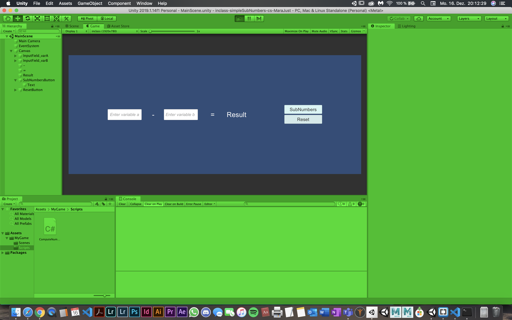
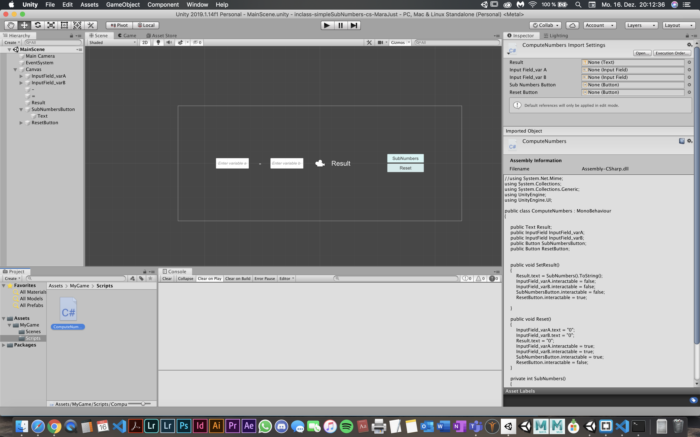

# Unity2019114f1-2D-Template

### Project description: 
simple program to subtract two numbers

### Development platform: 
MacOS Mojave (10.14.6), Unity 2019.1.14f1, Visual Studio Code 1.38.1

### Target platform: 
WebGL (RefRes: 1280x720 HD-720p) 

### Visuals: 

### Necessary setup/execution steps: 

- install unity
- install playmaker

### Third party material: 
(if used Fonts, Sounds, Music, Graphics, Materials, Code etc.)

### Project state: 
100% ready

### Limitations: 

### Lessons Learned: 
how to combine GUI and CS

Copyright by you :)